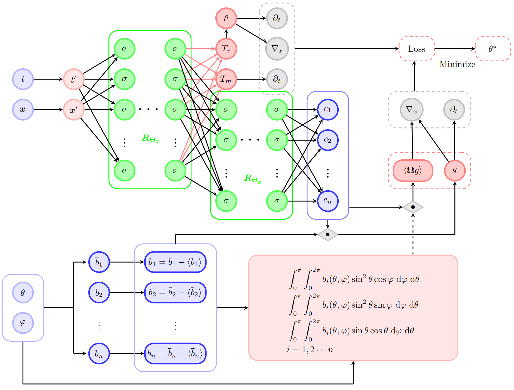

# BF-APNN: A Low-Memory Method for Accelerating the Solution of Radiative Transfer Equations

This repository hosts the research paper and related materials for BF-APNN, a novel low-memory neural network framework designed to accelerate the solution of high-dimensional and nonlinear Radiative Transfer Equations (RTEs). BF-APNN builds on the RT-APNN architecture by incorporating basis function expansions to reduce computational overhead during training, making it efficient for multiscale problems in fields like astrophysics and inertial confinement fusion.

📄 Abstract

The Radiative Transfer Equations (RTEs) exhibit high dimensionality and multiscale characteristics, rendering conventional numerical methods computationally intensive. Existing deep learning methods perform well in low-dimensional or linear RTEs, but still face many challenges with high-dimensional or nonlinear RTEs. To overcome these challenges, we propose the Basis Function Asymptotically Preserving Neural Network (BF-APNN), a framework that inherits the advantages of Radiative Transfer Asymptotically Preserving Neural Network (RT-APNN) and accelerates the solution process. By employing basis function expansion on the microscopic component, derived from micro-macro decomposition, BF-APNN effectively mitigates the computational burden associated with evaluating high-dimensional integrals during training. Numerical experiments, which involve challenging RTE scenarios featuring nonlinearity, discontinuities, and multiscale behavior, demonstrate that BF-APNN substantially reduces training time compared to RT-APNN while preserving high solution accuracy. Moreover, BF-APNN exhibits superior performance in addressing complex, high-dimensional RTE problems, underscoring its potential as a robust tool for radiative transfer computations.

Keywords: Radiative Transfer Equation, APNNs, Residual Network, Basis Function

👥 Authors

+ Xizhe Xie¹ 

+ Wengu Chen¹² 

+ Weiming Li¹ 

+ Peng Song¹³

+ Han Wang¹²³*  - Corresponding author

¹ Institute of Applied Physics and Computational Mathematics, Beijing 100088, China.

² National Key Laboratory of Computational Physics, Beijing 100088, China.

³ HEDPS, Center for Applied Physics and Technology, College of Engineering, Peking University, Beijing 100871, China.

The work of W. Chen is supported partly by the NSFC No. 12271050, Foundation of National Key Laboratory of Computational Physics (Grant No. 6142A05230503).

🔍 Overview

Radiative Transfer Equations (RTEs) describe photon transport and energy exchange in media, with applications in astrophysics, fusion, and more. Traditional methods struggle with high dimensionality, nonlinearity, and multiscale opacity. BF-APNN addresses these by:

+ Using micro-macro decomposition to separate equilibrium and non-equilibrium components.

+ Employing basis function expansions (e.g., Legendre polynomials, Fourier basis) to avoid costly numerical integrations.

+ Integrating Asymptotic-Preserving (AP) properties for seamless handling of transport-to-diffusion limits.

Compared to RT-APNN, BF-APNN reduces memory usage and accelerates training while maintaining accuracy in challenging scenarios like discontinuities and multiscale behavior.

Key Innovations

+ Network Structure: A concatenated micro-macro residual network (see figure below).

+ Loss Function: Physics-informed with AP properties to ensure convergence in multiscale regimes.

+ Basis Functions: Flexible selection (Legendre, Fourier, B-splines, spherical harmonics) for 1D and higher dimensions.

Micro-Macro Network Structure

Figure 3.1.1: Micro-macro network structure of BF-APNN. Here, (t, x) represents spatiotemporal variables, (θ, φ) represents angular variables, T_m is material temperature, T_r is radiation temperature, (ρ, g) represent macro and micro components.

📊 Results Highlights

Numerical experiments (Section 4 of the paper) demonstrate:

Training Time Reduction: Up to 50% faster than RT-APNN in high-dimensional RTEs.

Accuracy: High fidelity in nonlinear, discontinuous, and multiscale problems.

Efficiency: Low memory footprint.

For detailed results, refer to the full paper.

🛠 Installation & Usage

git clone https://github.com/1102118111/BF-APNN.git
